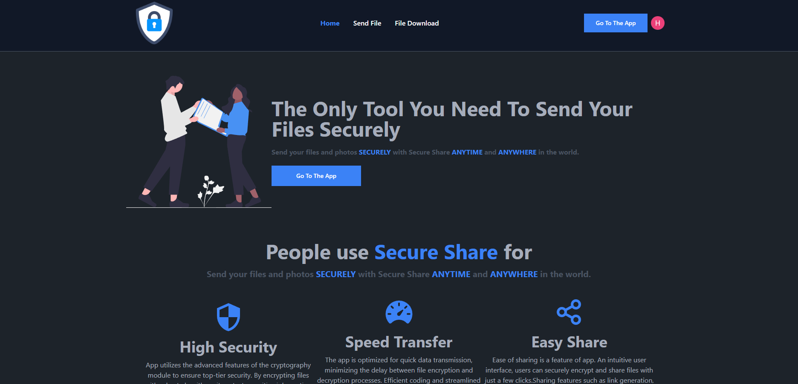
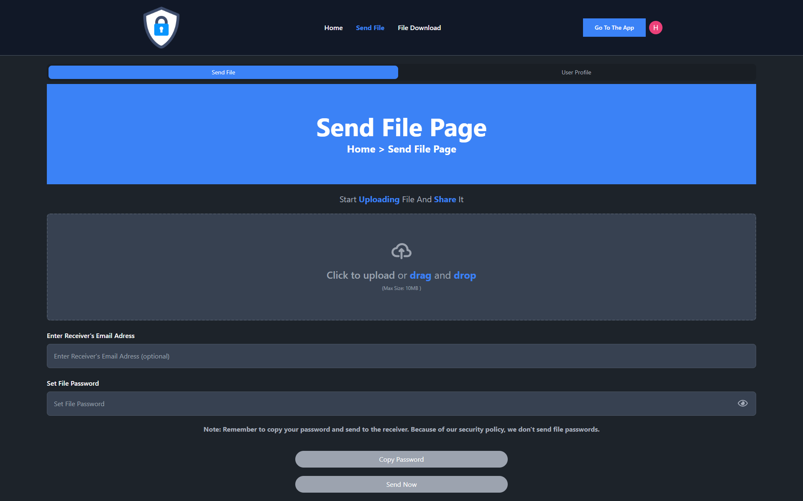
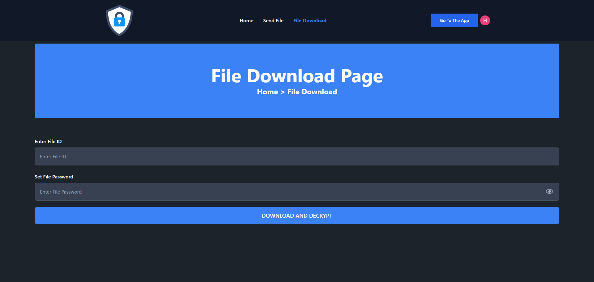

# Secured File Share

Secure File Sharing App is a comprehensive solution for secure file exchange, developed using the MERN (MongoDB, Express.js, React, Node.js) stack. This application enables users to share files with end-users with a high level of privacy and security. Featuring end-to-end encryption, password protection, input sanitization, brute force attack protection, protection against NoSQL injections, XSS attacks, and many other security measures, it stands as a modern web application designed to meet the highest standards of data protection.

# Application interface






# Features
- End-to-End Encryption: Leveraging strong encryption algorithms to ensure that files are encrypted from the moment they leave the sender's device until they are decrypted by the recipient, guaranteeing that the contents remain confidential and tamper-proof during transit.
- Password Protection: Adds an additional layer of security by allowing the sender to set a password on a file, which the recipient must enter to download or view the file, thereby preventing unauthorized access.
- Input Sanitization: Protects the application from various injection attacks by sanitizing user inputs, thus maintaining the integrity and security of the database.
- Brute Force Attack Protection: Implements sophisticated rate-limiting and account lockout mechanisms to thwart attackers attempting to guess passwords through repeated attempts.
- Protection Against NoSQL Injections and XSS Attacks: Employs input validation and output encoding strategies to defend against NoSQL injection and Cross-Site Scripting (XSS) vulnerabilities, ensuring the application's resilience against these common web attack vectors.
- Comprehensive Security Practices: Integrates a variety of security measures, including secure headers, HTTPS enforcement, and content security policies, to mitigate risks and protect against a wide range of vulnerabilities.

# Technologies Used
- MongoDB: For a flexible, scalable database.
- Express.js: To handle server-side logic and RESTful API endpoints.
- React: For building a dynamic and responsive user interface.
- Node.js: As the runtime environment for executing JavaScript on the server side.

# Getting Started
To get a local copy up and running, follow these simple steps.

# Prerequisites
- Node.js
- Internet connection

# Installation

1. Open your terminal of choice and clone the repository:
```
git clone https://github.com/AtOM18/SecureFileShare.git
```

2. Enter your environment variables in .env on the server
```
MONGO_URI=your_mongo_uri
MJ_APIKEY_PUBLIC=your_mail_jet_public_API_key
MJ_APIKEY_PRIVATE=your_mail_jet_private_API_key
```

3. Enter your environment variables in .env on the client
```
VITE_CLERK_PUBLISHABLE_KEY=your_clerk_key
```

4. In the root of the project create folder "uploads"

5. Open a terminal in the root of your project and run:
```
npm install
node app.js
```
6. Open a terminal in the /client of your project and run:
```
npm install
npm run dev
```

# Contributing
Contributions are what make the open-source community such an amazing place to learn, inspire, and create. Any contributions you make are greatly appreciated.
